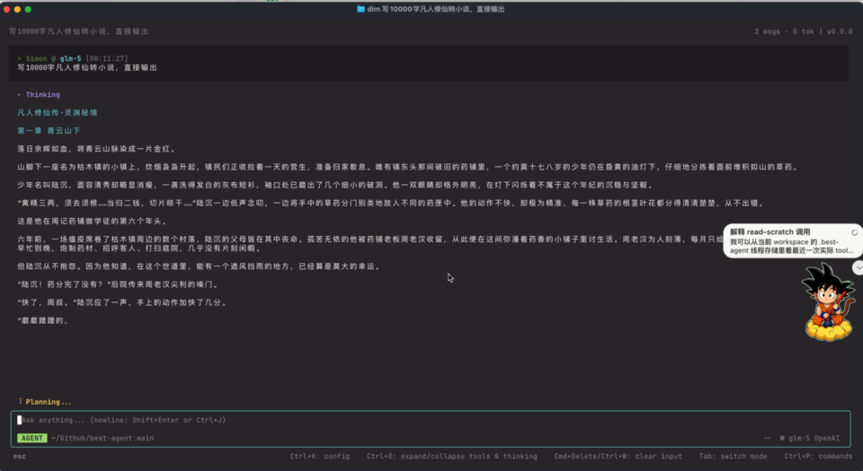

<p align="center">
  <picture>
    <source media="(prefers-color-scheme: dark)" srcset="./docs/public/brand/vue-tui-logo-on-dark.svg">
    <source media="(prefers-color-scheme: light)" srcset="./docs/public/brand/vue-tui-logo-on-light.svg">
    
  </picture>
</p>

# @simon_he/vue-tui

[](https://www.npmjs.com/package/@simon_he/vue-tui)
[](https://www.npmjs.com/package/@simon_he/vue-tui)
[](https://github.com/Simon-He95/vue-tui/actions/workflows/ci.yml)
[](https://github.com/Simon-He95/vue-tui/actions/workflows/runtime-compat.yml)
[](https://github.com/Simon-He95/vue-tui/actions/workflows/security.yml)


[](./license)

[Docs](https://vue-tui.pages.dev/) | [npm](https://www.npmjs.com/package/@simon_he/vue-tui) | [GitHub](https://github.com/Simon-He95/vue-tui) | [Issues](https://github.com/Simon-He95/vue-tui/issues)

Vue TUI is a Vue 3 terminal UI toolkit for building terminal-style interfaces that render to browser DOM, real CLI stdout, and headless tests.

Use it to build browser terminal dashboards, Vue-powered CLI apps, streaming markdown transcripts, log viewers, virtual lists, and AI agent consoles with one shared component model.

## Why Vue TUI?

- **Vue component model for terminal UIs**: build with `TerminalProvider`, `TBox`, `TInput`, `TList`, `TTable`, and more.
- **Browser + CLI renderers**: render the same UI model to browser DOM or real stdout.
- **High-throughput surfaces**: virtual lists, append-only logs, streaming markdown, and agent transcripts.
- **Clear host boundaries**: browser-safe root entrypoint, CLI-only APIs under `/cli`, sanitized links, and explicit host permissions.

## Agent UI Showcase

A real agent console built on `@simon_he/vue-tui` can stream agent output, markdown content, tool-call status, and input chrome in one terminal surface.

[](./docs/public/agent-console-rendering.mp4)

[Watch the rendering demo](./docs/public/agent-console-rendering.mp4)

## Install

```bash
pnpm add @simon_he/vue-tui vue
```

Vue is a peer dependency. The current package supports Vue `>=3.3.0 <4`.

## Runtime Support

The published package supports Node.js `>=16.17` for CLI/runtime consumers.

Development, release validation, and documentation builds are run on Node.js 20 in CI because the repository toolchain uses modern build/test tooling.

## Entry Points

| Import                                      | Stability    | Use it for                                                                                                                   |
| ------------------------------------------- | ------------ | ---------------------------------------------------------------------------------------------------------------------------- |
| `@simon_he/vue-tui`                         | Public       | Browser-safe terminal core, DOM renderer, stable Vue components, and input host plugin factory                               |
| `@simon_he/vue-tui/core`                    | Public       | Terminal core, buffer-facing types, ANSI/theme/path/hyperlink helpers                                                        |
| `@simon_he/vue-tui/renderer/dom`            | Public       | DOM renderer factory and renderer capabilities                                                                               |
| `@simon_he/vue-tui/vue`                     | Advanced     | Extended Vue components, composables, router helpers, and Vue runtime internals                                              |
| `@simon_he/vue-tui/runtime`                 | Advanced     | Runtime wiring, selection helpers, and clipboard abstraction                                                                 |
| `@simon_he/vue-tui/observability`           | Advanced     | Frame perf store, profiler hooks, and trace helpers                                                                          |
| `@simon_he/vue-tui/cli`                     | Public       | Node-only headless Vue app runtime, stdin driver, stdout renderer, path provider, recording, and terminal clipboard helpers  |
| `@simon_he/vue-tui/markdown`                | Public       | `TMarkdownText`, `TVirtualMarkdown`, markdown parser and layout helpers, streaming markdown block sources                    |
| `@simon_he/vue-tui/mermaid`                 | Public       | Optional `beautiful-mermaid` bridge and wrapper for `TMermaidText`                                                           |
| `@simon_he/vue-tui/experimental`            | Experimental | `T3DViewport`, `TVideo`, charts, `TVirtualList`, `TTranscriptView`, `TLogView`, TLog companions, and append-only log tooling |
| `@simon_he/vue-tui/experimental/video/node` | Experimental | Node-only lazy FFmpeg frame source plus optional yt-dlp resolver for supported video pages                                   |
| `@simon_he/vue-tui/experimental/3d/bun`     | Experimental | Bun-only raw WGSL/WebGPU Pull renderers, including the vue-tui terminal badge scene                                          |
| `@simon_he/vue-tui/agent`                   | Experimental | Agent/console transcript, tool-call header, log, markdown, virtual list, render plane, and overlay component aggregation     |
| `@simon_he/vue-tui/agent/mermaid`           | Experimental | Agent namespace optional `beautiful-mermaid` bridge and wrapper for `TMermaidText`                                           |

The stable surface is terminal core, DOM rendering, CLI runtime, basic Vue components, markdown APIs, and the optional Mermaid bridge. High-throughput log, virtualization, and agent/console aggregation APIs stay under `/experimental` or `/agent` until their public surface settles; keep those imports isolated in application code. Use `/agent/mermaid` when agent code wants the optional Mermaid wrapper without changing the `/agent` main entrypoint.

Experimental chart components are imported from the `/experimental` entrypoint:

```ts
import {
  TCandlestickChart,
  TContributionGraph,
  TLineChart,
  TPieChart,
} from "@simon_he/vue-tui/experimental";
```

`T3DViewport` is renderer-agnostic and Pull-based. The bundled WGSL renderer is isolated in the Bun-only entrypoint so browser-safe imports do not load native GPU code:

```ts
import { T3DViewport } from "@simon_he/vue-tui/experimental";
import { createTerminalBadge3DRenderer } from "@simon_he/vue-tui/experimental/3d/bun";

const renderer = createTerminalBadge3DRenderer();
```

Install the optional `bun-webgpu` peer, then run the complete direction-E terminal badge example with `bun run run:3d:terminal`. Drag to orbit and use a two-finger trackpad gesture or mouse wheel to zoom. CLI hover steering requires `createStdinDriver({ enableMouseMotion: true })`.

#### `experimental/3d/bun` platform requirements

| Requirement                 | Detail                                               |
| --------------------------- | ---------------------------------------------------- |
| Runtime                     | **Bun only** — Node.js and browser are not supported |
| `bun-webgpu` peer           | Must be installed manually: `bun add bun-webgpu`     |
| macOS x64 / arm64           | ✅ Prebuilt binary available                         |
| Linux x64                   | ✅ Prebuilt binary available                         |
| Windows x64                 | ✅ Prebuilt binary available                         |
| Linux arm64 / musl (Alpine) | ❌ No prebuilt binary — must build from source       |

> `T3DViewport` itself (from `/experimental`) has zero native dependencies and works everywhere. Only `experimental/3d/bun` requires Bun and the optional peer. `bun-webgpu` is an experimental library; see [bun-webgpu](https://github.com/kommander/bun-webgpu) for current status.

Do not deep import from `@simon_he/vue-tui/dist/...`; only the entry points above are part of the supported package contract.

### Migration: Node Host Adapter Moved To `/cli`

Node-specific input host defaults are no longer exported from the browser-safe root entrypoint.

Before:

```ts
import { createDefaultTInputHostAdapter, defaultTInputHostPlugin } from "@simon_he/vue-tui";
```

After:

```ts
import { createTInputHostPlugin } from "@simon_he/vue-tui";
import { createDefaultTInputHostAdapter, defaultTInputHostPlugin } from "@simon_he/vue-tui/cli";
```

### Migration: Root Entry Was Narrowed

The root entrypoint now keeps only stable browser-safe APIs. Extended Vue components and Vue router/composable helpers move to `@simon_he/vue-tui/vue`.

| Before root import | New import              |
| ------------------ | ----------------------- |
| `TAnchor`          | `@simon_he/vue-tui/vue` |
| `TFlow`            | `@simon_he/vue-tui/vue` |
| `TInputBox`        | `@simon_he/vue-tui/vue` |
| `TPathPicker`      | `@simon_he/vue-tui/vue` |
| `TJsonEditor`      | `@simon_he/vue-tui/vue` |
| `TRenderPlane`     | `@simon_he/vue-tui/vue` |
| `TRenderLayer`     | `@simon_he/vue-tui/vue` |
| `TTransition`      | `@simon_he/vue-tui/vue` |
| router/composables | `@simon_he/vue-tui/vue` |
| Node host defaults | `@simon_he/vue-tui/cli` |

Before:

```ts
import { TAnchor, TFlow } from "@simon_he/vue-tui";
```

After:

```ts
import { TAnchor, TFlow } from "@simon_he/vue-tui/vue";
```

### Hyperlinks

DOM renderer link rendering is opt-in through `domRendererOptions.links`. Once enabled, DOM anchors allow safe absolute and relative targets such as `https:`, `http:`, `mailto:`, `/path`, `./path`, `../path`, `#hash`, and `?q=1`. Link callbacks preserve native browser behavior unless they return `false`.

CLI/stdout rendering uses OSC8 hyperlinks and keeps a stricter boundary: only safe absolute `https:`, `http:`, and `mailto:` hrefs are emitted by default. `file:` links stay opt-in for terminal-specific providers and lower-level `Style.href` writers.

`TLink` is the public component-level link primitive. It renders DOM-safe `Style.href` metadata for absolute `https:` / `http:` / `mailto:` and relative targets, supports focus, click, keyboard activation, and host-controlled attempted opens through `TerminalProvider.linkOpener` or `createTerminalApp({ linkOpener })`. `TLinkifyText` detects safe URLs in plain text and writes the same href metadata without owning activation. Browser `TerminalProvider` defaults to `window.open`; CLI/headless apps must opt in. `TLink` intentionally rejects `file:` URLs; use lower-level `Style.href` writers plus terminal-specific opt-in when exposing file links.

## Browser Usage

```vue
<script setup lang="ts">
import { ref } from "vue";
import { TerminalProvider, TBox, TInput, TLink, TLinkifyText, TText } from "@simon_he/vue-tui";

const input = ref("");
</script>

<template>
  <TerminalProvider :cols="80" :rows="24" :default-style="{ fg: 'whiteBright' }">
    <TBox :x="0" :y="0" :w="80" :h="24" border title="Demo" :padding="1">
      <TText :x="0" :y="0" :w="78" value="Vue TUI is running" />
      <TLink :x="0" :y="2" href="https://github.com/Simon-He95/vue-tui" label="Project link" />
      <TLinkifyText :x="0" :y="3" :w="78" value="Docs: https://github.com/Simon-He95/vue-tui" />
      <TInput :x="0" :y="20" :w="78" v-model="input" placeholder="Type..." />
    </TBox>
  </TerminalProvider>
</template>
```

`TerminalProvider` wires the terminal buffer, DOM renderer, event manager, scheduler, runtime, layout context, and input plugins for browser Vue apps.

## CLI Usage

For a real terminal, mount a headless Vue app and attach stdout/stdin:

```ts
import {
  createStdinDriver,
  createStdoutRenderer,
  createTerminalApp,
  installTerminalCleanup,
  type TerminalCleanupHandle,
} from "@simon_he/vue-tui/cli";
import App from "./App.vue";

const app = createTerminalApp({
  cols: process.stdout.columns || 80,
  rows: process.stdout.rows || 24,
  component: App as any,
  defaultStyle: { fg: "whiteBright" },
});

app.mount();

const renderer = createStdoutRenderer(app.terminal, {
  output: process.stdout,
  hideCursor: true,
  colorMode: "auto",
  allowFileUrls: true,
});

app.scheduler.flush();

let driver: ReturnType<typeof createStdinDriver> | null = null;
let terminalCleanup: TerminalCleanupHandle | null = null;
let disposed = false;

const cleanup = () => {
  if (disposed) return;
  disposed = true;
  terminalCleanup?.uninstall();
  driver?.dispose();
  renderer.dispose();
  app.dispose();
};

const exit = () => {
  cleanup();
  process.exit(0);
};

terminalCleanup = installTerminalCleanup(cleanup, {
  signalPolicy: "reraise",
  cleanupOnUnhandledRejection: false,
});
driver = createStdinDriver({
  dispatch(event) {
    const prevented = app.events.dispatch(event);
    app.scheduler.flush();
    return prevented;
  },
  enableMouse: true,
  onExit: exit,
});
```

Signal cleanup restores terminal state first. `installTerminalCleanup()` returns a cleanup handle: call `handle.uninstall()` to remove process listeners without disposing the app, or `handle.cleanup()` to run cleanup manually. By default, signal handling uses `signalPolicy: "reraise"`: the helper cleans up, removes its own listeners, and re-sends the original signal when no other listener owns that signal. If the host process has other listeners for the same signal, those listeners keep ownership of termination. Set `signalPolicy: "cleanup-only"` only when the host explicitly owns termination, or `signalPolicy: "exit"` when vue-tui should exit with the conventional signal exit code after cleanup.

Unhandled promise rejections stay host-owned by default. Setting `cleanupOnUnhandledRejection: true` cleans up and rethrows by default. Set `rethrowUnhandledRejection: false` only when the host explicitly wants to suppress the rejection.

## Core Concepts

- `createTerminal({ cols, rows })` owns the cell buffer, cursor, planes, scrollback, and commit events.
- `createDomRenderer(terminal, container)` renders terminal cells to DOM with row caching and fast paths for plain and styled rows.
- `createStdoutRenderer(terminal, options)` emits ANSI output for real terminal UIs from `/cli`.
- `TerminalProvider` is the browser-facing Vue runtime provider.
- `createTerminalApp()` is the headless runtime for CLI apps and deterministic tests.
- `TRenderPlane` separates transcript, chrome, input, and overlay surfaces so small updates do not repaint large panes.

## Components

| Area           | Import                                      | Components / APIs                                                                                                                                                                                |
| -------------- | ------------------------------------------- | ------------------------------------------------------------------------------------------------------------------------------------------------------------------------------------------------ |
| Stable layout  | `@simon_he/vue-tui`                         | `TBox`, `TView`                                                                                                                                                                                  |
| Stable text    | `@simon_he/vue-tui`                         | `TText`, `TLink`, `TLinkifyText`                                                                                                                                                                 |
| Stable input   | `@simon_he/vue-tui`                         | `TInput`, `TList`, `TSelect`                                                                                                                                                                     |
| Stable overlay | `@simon_he/vue-tui`                         | `TDialog`                                                                                                                                                                                        |
| Vue extended   | `@simon_he/vue-tui/vue`                     | `TAnchor`, `TFlex`, `TFlexItem`, `TFlow`, `TRenderPlane`, `TRenderLayer`, `TTransition`, `TInputBox`, `TPathPicker`, `TJsonEditor`, `TMultilineModal`, `TDebugOverlay`, composables, router APIs |
| Markdown       | `@simon_he/vue-tui/markdown`                | `TMarkdownText`, `TVirtualMarkdown`                                                                                                                                                              |
| Mermaid        | `@simon_he/vue-tui/mermaid`                 | `beautifulMermaidRenderer`, `TMermaid`, `TMermaidText`, `TBeautifulMermaidText`                                                                                                                  |
| Experimental   | `@simon_he/vue-tui/experimental`            | `TVideo`, `TContributionGraph`, `TLineChart`, `TCandlestickChart`, `TPieChart`, `TVirtualList`, `TTranscriptView`, `TLogView`, `TLogSearchBar`, `TLogLinksPanel`, `TLogScrollbar`, `TLogMinimap` |
| Video adapter  | `@simon_he/vue-tui/experimental/video/node` | `createFfmpegVideoFrameSource`, `createYtDlpVideoFrameSource`                                                                                                                                    |
| Agent console  | `@simon_he/vue-tui/agent`                   | `TAgentTranscript`, `TToolCallView`, `TToolLogView`, `TVirtualMarkdown`, `TVirtualList`, `TRenderPlane`                                                                                          |
| Agent Mermaid  | `@simon_he/vue-tui/agent/mermaid`           | `beautifulMermaidRenderer`, `TMermaid`, `TMermaidText`, `TBeautifulMermaidText`                                                                                                                  |
| Runtime        | `@simon_he/vue-tui/runtime`                 | runtime, event, and selection APIs                                                                                                                                                               |
| CLI            | `@simon_he/vue-tui/cli`                     | `createTerminalApp`, `createStdoutRenderer`, `createStdinDriver`, Node host adapters                                                                                                             |

For streaming Mermaid source, pass `streaming` with `final`. When `streaming=true` and `final=false`, transient renderer errors do not replace the last successfully rendered diagram; if no diagram has rendered yet, `incompleteText` is shown until the source becomes renderable or `final=true` surfaces the final error.

This table is a category overview. The generated API reference for root, `/vue`, and `/experimental` components lives in [docs/generated/components-api.md](./docs/generated/components-api.md) for humans and [docs/generated/api-manifest.json](./docs/generated/api-manifest.json) for CI, release checks, and README/docs drift checks; the manifest also tracks package entrypoint exports.

## Documentation

| Page                                                               | Purpose                                                              |
| ------------------------------------------------------------------ | -------------------------------------------------------------------- |
| [Docs home](./docs/index.md)                                       | Product overview and reading path                                    |
| [Vue Terminal UI](./docs/guide/vue-terminal-ui.md)                 | English landing page for terminal-style Vue interfaces               |
| [Vue CLI UI](./docs/guide/vue-cli-ui.md)                           | CLI app model with Vue component composition                         |
| [CLI stdout renderer](./docs/guide/cli-stdout-renderer.md)         | Stdout renderer, stdin driver, cleanup, and terminal output          |
| [Terminal log viewer](./docs/guide/terminal-log-viewer.md)         | Append-only logs, retained windows, wrapping, links, and search      |
| [Markdown transcripts](./docs/guide/markdown-transcript.md)        | Static and streaming markdown transcript rendering                   |
| [Examples index](./docs/examples.md)                               | Browser, terminal, and smoke example commands                        |
| [Core API](./docs/api.md)                                          | Terminal, renderer, events, runtime, planes, and scheduler contracts |
| [Terminal UI best practices](./docs/terminal-ui-best-practices.md) | Cell layout, input focus, render invalidation, transcripts, tests    |
| [Performance](./docs/performance.md)                               | Practical performance guidance                                       |
| [Benchmarks](./docs/benchmarks.md)                                 | Release benchmark budgets, sample results, and comparison boundaries |
| [OpenTUI Solid comparison](./docs/compare-opentui-solid.md)        | Same-scenario comparison protocol and public claim boundaries        |
| [High-throughput rendering](./docs/high-throughput-rendering.md)   | Scheduler, dirty rows, mailbox, log, and renderer architecture       |
| [Component acceptance](./docs/components-acceptance.md)            | Release readiness checks for component API and behavior              |
| [Agent Console](./docs/agent-console.md)                           | Streaming transcript example stack                                   |
| [Release candidate](./docs/release-candidate.md)                   | 1.0 RC validation, package export checks, and migration notes        |
| [Security policy](./SECURITY.md)                                   | Vulnerability reporting and terminal permission boundaries           |

Run the docs locally:

```bash
pnpm run docs:dev
pnpm run docs:build
```

## Examples

```bash
pnpm -C examples/basic dev
pnpm run build:examples
pnpm run build:examples:terminal
pnpm run run:basic:terminal
pnpm run run:agent-console:terminal
pnpm run example:tlog-view-lab
pnpm run example:agent-console
pnpm run example:agent-console:smoke
pnpm run example:agent-console:terminal:smoke
```

The smoke commands are deterministic and avoid real LLM APIs, real TTY dependencies, and timing-only pass/fail gates.

## Performance Notes

- Use `TVirtualList` instead of rendering thousands of row components.
- Use `TLogView` with `createAppendOnlyLogStore({ maxLines })` for retained streaming logs.
- Provide stable line keys for custom `TLogView` sources; mutable rows should change keys or call the explicit invalidation APIs.
- Split high-volume content and frequently changing chrome into different `TRenderPlane`s.
- Style objects are treated as immutable. Reuse stable style objects on hot paths, but pass a new object when a style changes.

Useful checks:

```bash
pnpm run bench:dom-renderer
pnpm run bench:scroll-mailbox
pnpm run bench:phase2
```

## Issues And Feedback

- Report bugs: [new bug report](https://github.com/Simon-He95/vue-tui/issues/new?template=bug_report.yml)
- Request features: [new feature request](https://github.com/Simon-He95/vue-tui/issues/new?template=feature_request.yml)
- Report documentation issues: [new docs issue](https://github.com/Simon-He95/vue-tui/issues/new?template=docs.yml)
- Report vulnerabilities privately: [Security policy](./SECURITY.md)
- Browse existing issues: [GitHub issues](https://github.com/Simon-He95/vue-tui/issues)

For renderer, scheduler, or terminal behavior bugs, include the renderer target (`DOM`, `stdout`, or headless), the relevant command, and a minimal reproduction when possible.

## Development

Use Node.js 20 for repository development, release validation, and documentation builds. This is a toolchain requirement, not the runtime requirement for the published package.

```bash
pnpm install
pnpm run format:check
pnpm run lint
pnpm run typecheck
pnpm run test
pnpm run build
```

Release validation:

```bash
pnpm run release:dry-run
```

`release:dry-run` runs checks, tests, docs build, benchmarks, examples smoke, and packed package install smoke.
`release:ci` aliases `release:dry-run` for validation-only CI usage. The GitHub Release workflow is preferred because it publishes the already-verified tarball with npm provenance. If workflow token/provenance is unavailable, `release:local:dry-run` and `release:local` publish the locally verified tarball with the `rc` dist-tag. `release` and `release:workflow-only` intentionally fail to avoid accidental direct publishing.

## Package Notes

- The published package ships `dist` only.
- Root, core, runtime, DOM renderer, observability, Vue, CLI, markdown, experimental, and agent entrypoints are available as ESM, CJS, and type declarations after build.
- The Mermaid bridge entrypoints ship ESM, CJS, and type declarations.
- The root browser/core API does not require a Node runtime, but CLI usage expects a Node-like stdout/stdin environment.
- Terminal emoji and East Asian width behavior still depends on the user terminal and font.

## License

[MIT](./license)
