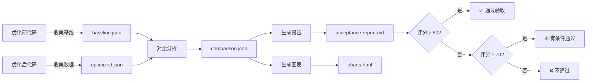

# 性能数据分析和验收报告系统

这是一套完整的自动化性能测试、数据收集、对比分析和验收报告生成系统，用于 vue-tui 优化方案的验证。

## 📁 文件结构

```
vue-tui/
├── scripts/
│   ├── collect-baseline.ts          # 基线数据收集脚本
│   ├── collect-optimized.ts         # 优化后数据收集脚本
│   ├── compare-performance.ts       # 性能对比分析脚本
│   ├── generate-report.ts           # Markdown 报告生成器
│   └── generate-charts.ts           # 数据可视化图表生成器
├── docs/
│   └── ACCEPTANCE_REPORT_TEMPLATE.md # 验收报告模板
├── .github/
│   └── workflows/
│       └── acceptance-test.yml       # CI/CD 自动化测试配置
└── .performance-data/                # 性能数据存储目录（自动创建）
    ├── baseline-latest.json
    ├── optimized-latest.json
    ├── comparison-*.json
    ├── acceptance-report-*.md
    ├── charts.json
    └── charts.html
```

## 🚀 快速开始

### 1. 收集基线数据（优化前）

在优化前的代码分支上运行：

```bash
pnpm exec tsx scripts/collect-baseline.ts
```

这将：
- 测试文本处理性能（ASCII、CJK、Emoji 等）
- 测量缓存性能（命中率、淘汰频率）
- 评估渲染性能（不同终端尺寸）
- 测试虚拟滚动性能
- 监控内存使用
- 验证已知 Bug 状态

数据保存到：`.performance-data/baseline-latest.json`

### 2. 应用优化并收集数据

切换到优化后的代码分支：

```bash
git checkout optimized-branch
pnpm exec tsx scripts/collect-optimized.ts
```

数据保存到：`.performance-data/optimized-latest.json`

### 3. 对比分析

```bash
pnpm exec tsx scripts/compare-performance.ts
```

生成对比分析数据：`.performance-data/comparison-*.json`

输出示例：
```
📊 Comparing performance data...
Baseline: .performance-data/baseline-latest.json
Optimized: .performance-data/optimized-latest.json

✅ Comparison report generated!
📁 Report: .performance-data/comparison-1234567890.json

📈 Summary:
  Overall Performance Gain: 42.5%
  Bugs Fixed: 3/3
  Regressions Detected: 0
  Total Score: 92.3/100
  Acceptance: ✅ PASSED
```

### 4. 生成验收报告

```bash
pnpm exec tsx scripts/generate-report.ts
```

生成 Markdown 格式的详细验收报告：`.performance-data/acceptance-report-*.md`

### 5. 生成可视化图表

```bash
pnpm exec tsx scripts/generate-charts.ts
```

生成：
- `charts.json` - 图表数据（Chart.js 格式）
- `charts.html` - 交互式 HTML 图表页面

在浏览器中打开 `charts.html` 查看：
- 📊 性能对比柱状图
- 📈 缓存命中率趋势
- 💾 内存占用时间序列
- 🎯 FPS 分布直方图
- 🕸️ 整体评分雷达图
- ✅ Bug 修复状态

## 📊 验收标准

系统自动评估以下验收标准：

### Bug 修复（必须通过）
1. **代理对检测**: 100% 准确识别 Surrogate Pair
2. **实例隔离**: 完全隔离多实例缓存
3. **长文本性能**: 10k 字符处理 < 100ms

### 性能优化（目标）
- ASCII 文本处理性能提升 > +50%
- CJK 文本处理性能提升 > +20%
- 缓存命中率提升 > +20%
- 内存增加 < 2MB
- 无性能回退

### 总体评分
- **≥ 80 分**: ✅ 通过
- **70-79 分**: ⚠️ 有条件通过
- **< 70 分**: ❌ 不通过

## 🤖 CI/CD 自动化

### GitHub Actions 工作流

位置：`.github/workflows/acceptance-test.yml`

**触发条件**：
- Pull Request 到 main/master 分支
- 手动触发（workflow_dispatch）

**工作流程**：
1. **collect-baseline**: 检出基线代码，收集性能数据
2. **collect-optimized**: 检出优化代码，收集性能数据
3. **compare-and-report**: 对比分析，生成报告和图表
4. 自动在 PR 中评论结果摘要
5. 上传完整报告和图表作为 Artifacts

**使用方式**：

自动触发（PR）：
```bash
git checkout -b feature/optimization
# 进行优化...
git commit -m "perf: optimize text processing"
git push origin feature/optimization
# 创建 PR，自动触发测试
```

手动触发：
1. 进入 GitHub Actions 页面
2. 选择 "Performance Acceptance Test" 工作流
3. 点击 "Run workflow"
4. 指定 baseline 和 comparison 分支

## 📈 数据格式

### BaselineData / OptimizedData

```typescript
{
  timestamp: number,
  version: string,
  commit: string,
  environment: {
    nodeVersion: string,
    platform: string,
    cpuModel: string,
    totalMemory: number,
    // ...
  },
  benchmarks: {
    textProcessing: {
      asciiShort: { avgTimeMs, minTimeMs, maxTimeMs, stdDev, iterations, opsPerSec },
      asciiLong: { ... },
      cjkShort: { ... },
      // ...
    },
    cachePerformance: { cellCacheHitRate, textCacheHitRate, ... },
    renderingPerformance: { smallTerminal, mediumTerminal, ... },
    virtualScrollPerformance: { smallList, mediumList, ... },
    memoryPerformance: { baseline, after1hRendering, ... }
  },
  bugValidation: {
    surrogatePairDetection: { passed, message, details },
    multiInstanceIsolation: { ... },
    longTextPerformance: { ... }
  }
}
```

### ComparisonReport

```typescript
{
  summary: {
    overallPerformanceGain: number,
    bugsFixed: number,
    regressionsDetected: number,
    acceptancePassed: boolean,
    totalScore: number
  },
  detailed: {
    textProcessing: ComparisonResult[],
    cachePerformance: ComparisonResult[],
    // ...
  },
  bugFixes: BugFixValidation[],
  regressionAnalysis: {
    performanceRegressions: ComparisonResult[],
    memoryRegressions: ComparisonResult[]
  },
  acceptanceCriteria: {
    criteria: string,
    target: string | number,
    actual: string | number,
    passed: boolean
  }[]
}
```

## 🛠️ 自定义和扩展

### 添加新的性能测试

编辑 `scripts/collect-baseline.ts`：

```typescript
// 添加新的 benchmark 函数
async function benchmarkNewFeature(): Promise<NewFeatureBenchmarks> {
  return {
    scenario1: benchmark(() => {
      // 测试代码
    }, 1000),
    scenario2: benchmark(() => {
      // 测试代码
    }, 500),
  }
}

// 在 collectBaselineData 中调用
export async function collectBaselineData(): Promise<BaselineData> {
  return {
    // ...
    benchmarks: {
      // ...
      newFeature: await benchmarkNewFeature(),
    },
  }
}
```

### 自定义验收标准

编辑 `scripts/compare-performance.ts` 中的阈值：

```typescript
// 修改性能提升目标
let threshold = 20
if (category.startsWith('ascii')) threshold = 50  // ASCII 目标 50%
if (category.startsWith('cjk')) threshold = 30    // CJK 目标调整为 30%
```

### 添加新图表

编辑 `scripts/generate-charts.ts`：

```typescript
function generateNewChart(baseline: any, optimized: any): ChartData {
  return {
    type: 'line', // 或 'bar', 'radar', 'pie' 等
    title: '新图表标题',
    data: {
      labels: ['Label1', 'Label2', ...],
      datasets: [{ label: '数据集', data: [...] }]
    },
    options: { /* Chart.js 配置 */ }
  }
}
```

## 🔍 故障排查

### 数据收集失败

**问题**：脚本运行报错
**解决**：
```bash
# 确保项目已构建
pnpm run build

# 检查依赖
pnpm install

# 查看详细错误
pnpm exec tsx scripts/collect-baseline.ts --verbose
```

### 对比分析找不到数据

**问题**：`No comparison report found`
**解决**：
```bash
# 确保先收集了基线和优化数据
ls -la .performance-data/

# 应该包含：
# - baseline-latest.json
# - optimized-latest.json
```

### CI/CD 工作流失败

**问题**：GitHub Actions 失败
**解决**：
1. 检查 Actions 日志查看具体错误
2. 确保 `pnpm` 版本正确（packageManager 字段）
3. 验证脚本在本地能正常运行

## 📚 最佳实践

1. **定期收集基线**: 在主要版本发布前建立基线
2. **保留历史数据**: 保存每次优化的对比数据用于趋势分析
3. **迭代优化**: 使用报告反馈持续改进
4. **文档化**: 记录每次优化的动机和结果
5. **回归测试**: 每次修改后运行完整测试套件

## 📝 报告示例

查看 `docs/ACCEPTANCE_REPORT_TEMPLATE.md` 了解完整的报告结构。

典型报告包含：
- ✅ 执行摘要和关键指标
- 🐛 Bug 修复验证
- 📊 详细性能对比（5个维度）
- ⚠️ 破坏性变更检测
- ✅ 验收标准评估
- 🔍 风险和建议
- 🎯 最终验收决策

## 🎯 验收流程



## 🤝 贡献

欢迎提交 PR 改进此系统：
- 添加新的性能指标
- 优化图表展示
- 改进报告格式
- 增强 CI/CD 集成

## 📄 许可

MIT License - 与 vue-tui 项目保持一致

---

**维护者**: vue-tui 团队  
**最后更新**: 2026-07-09
